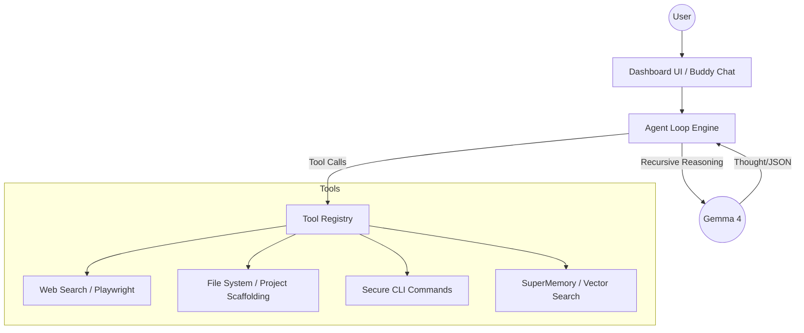

# 🏰 Camelot-IDE — Genesis v1.0.0

[](https://github.com/tony1/camelot-ide)
[](https://opensource.org/licenses/MIT)
[](https://ollama.com/library/gemma4)

**Camelot-IDE** è un ambiente di sviluppo autonomo potenziato dall'intelligenza artificiale locale (**Gemma 4**). Progettato per essere veloce, sicuro e completamente privato, Camelot si integra nel tuo workflow per gestire ricerche web, scaffolding di progetti e automazione dei task tramite un loop agentico ricorsivo.

---

## ✨ Caratteristiche Principali

- **🤖 Loop Agentico Autonomo**: Ember (il nostro shiny 🦊) può ragionare su più passaggi, decidere quali tool usare e correggersi da solo.
- **🌐 Ricerca Web in Tempo Reale**: Integrazione nativa con Playwright per navigare il web e sintetizzare informazioni fresche.
- **🎙️ Controllo Vocale Whisper**: Comanda il tuo IDE a voce con mapping intelligente delle keyword.
- **🧠 SuperMemory**: Una memoria persistente cross-sessione che impara dalle tue ricerche e interazioni passate.
- **🛡️ 100% Locale & Sicuro**: Funziona interamente su Ollama. I tuoi dati non lasciano mai la tua RTX.

---

## 🏗️ Architettura



---

## 🚀 Guida Rapida

### 1. Prerequisiti
- **Bun v1.3+**
- **Ollama** con modello `gemma4:latest`
- **Playwright** (`bun x playwright install chromium`)

### 2. Installazione
```bash
git clone https://github.com/tony1/camelot-ide.git
cd camelot-ide
bun install
```

### 3. Configurazione
Copia il file `.env.example` in `.env` e configura il tuo `CAMELOT_AUTH_TOKEN`.
> [!IMPORTANT]
> Non condividere mai il tuo Auth Token. Camelot lo usa per proteggere le comunicazioni tra la dashboard e il server locale.

### 4. Avvio
Scarica il **Camelot Launcher** o avvia manualmente:
```bash
bun run start
```
Naviga su `http://localhost:3001` per accedere alla dashboard.

---

## 🛠️ Stack Tecnologico

- **Runtime**: Bun (Fast JS/TS)
- **AI Engine**: Ollama (Llama.cpp / Gemma 4)
- **Browser**: Playwright (Headless Chromium)
- **Frontend**: Vanilla JS + CSS Glassmorphism
- **Storage**: JSON + File System Local Fallback

---

## 📜 Licenza
Rilasciato sotto licenza MIT. Vedi [LICENSE](LICENSE) per i dettagli.

---

*Creato con ❤️ dal team di Camelot — "Where Code Meets Magic"*
